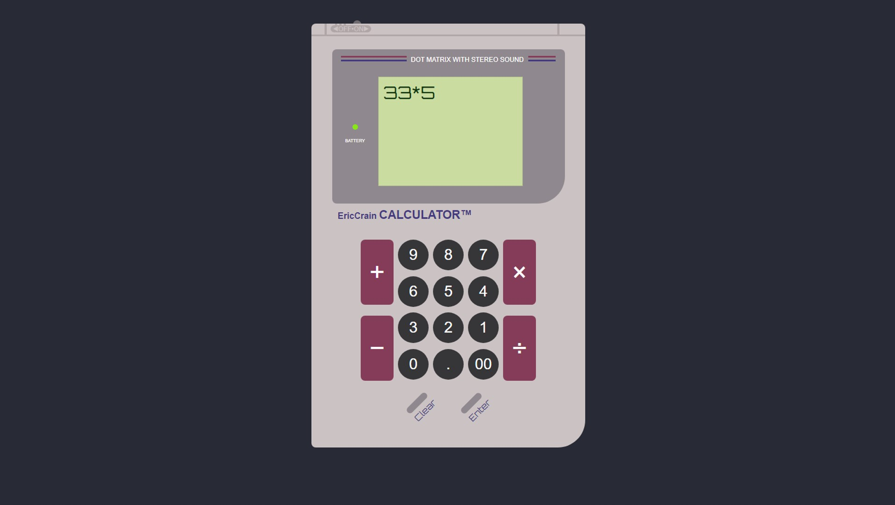

# Calculator App

Deployed Application: https://ericcrain77.github.io/calculator-app/

GitHub Repository: https://github.com/Ericcrain77/calculator-app

## Licensing

## Table of Contents
* [Description](#description)
* [Screenshot](#screenshot)
* [Technologies](#technologies)
* [Questions](#questions)

## Description
A simple calculator web application. 

## Screenshot

## Technologies
This website is being built with HTML, CSS, and vanilla JavaScript.

## Questions
Reach out to me using my [Github account](https://github.com/Ericcrain77) or my [email](ericcrain77@gmail.com).